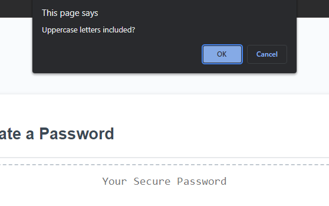

## Password Generator Challenge

### Goal

For this challenge, we were tasked with making a password generator that allows the user to enter how many characters long and if there are uppercase letters, lowercase letters, numbers, and/or special characters. This is all done using javascript elements.

### Final Thoughts

Project was both hard and easy. Figuring out how I wanted things to work was the hard part. The planning stage and finding my basis took a while. After the planning part, it was generally smooth sailing until I found a bug in my code. I was testing this code more than I normally do and was using the chrome debugger tool a lot more. This helped a lot as it didn't require me to go through the code loop multiple times. I could just test values and functions right from the console.

### Website preview

[GitHub Deployed Page](https://mikeymizell.github.io/Password-Generator/)

### Contact Info

[Email Here](mailto:mikey.mizell.2016@gmail.com) | 
[LinkedIn Profile](https://www.linkedin.com/in/michael-mizell-ii-803861141/)
